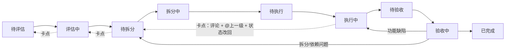

# Codex 集成需求文档

> 版本：v1.4（定稿）
> 日期：2026-08-03
> 关联：Plane CE 1.4.0（`preview` 分支 fork），部署与交接见 [部署说明.md](./部署说明.md)、[交接文档.md](./交接文档.md)

> 决策记录：v1.1 与开发对齐后定稿——① 卡点/退回**直接改回上一环节状态**，不设独立"退回中"状态；② 状态推进**完全原生自由**，不加自定义权限校验；③ 本期范围**不做自动化**（半自动/全自动 runner 均推迟），仅"人用原生流程 + Codex 可被指派执行并手动触发回写"；④ v1.2 起 **Codex 按流程角色一账号一机器人（方案 B）**：评估/拆分/执行/验收各一个账号，均 MEMBER(15)；⑤ v1.3（2026-08-03）早期 `codex_bot` 已清理，仅保留 4 个角色账号；⑥ v1.4（2026-08-03）中途对需求确认父子任务流转规则（拆分者判断：不需拆分则父任务直接走流程；需拆分则父任务停在拆分者处，全部子任务完成后流转——成功→已完成、失败→返回评估者），且**待执行→执行中由执行者自行推进**。

---

## 1. 目标

把 Plane 当作**任务流程工具本身**来使用；流程中的"执行者"角色由 **Codex**（机器人成员）承担，其余角色与交互保持原生。

一句话：**不是给 Plane 加流程，而是把流程里的人换成 Codex。**

---

## 2. 核心决策（已确认）

1. **不做自定义工作流覆盖层**：不新增流程字段、API、前端面板。此前实现已全部移除（提交 `fd35372`，迁移 `0124` 删除字段）。
2. **Codex = 普通项目成员**：`MEMBER(15)`，非管理员；可被指派为任意环节的负责人（主要是执行者）。
3. **环节 = Plane 自定义状态**；**当前环节负责人 = assignee**；**任务单 = 子任务**（原生父子 issue）。
4. **卡点/退回 = 评论 + @上一级 + 状态直接改回上一环节状态**（无独立"退回中"状态）；**验收 = 验收人把状态推进到"已完成"**。
5. **Codex 配置不进数据库、不进 git**：API token 与代码路径存于 `apps/api/.env`（gitignored）。
6. **本期不做自动化**：不写 runner/脚本轮询；Codex 执行由人触发，回写由 Codex 通过 API 手动完成。
7. **状态推进不设自定义权限校验**：任何项目成员均可推进状态（原生行为），环节纪律靠流程约定与评论留痕约束。
8. **Codex 按流程角色拆分为多个账号**：评估者 `codex_eval`、拆分者 `codex_split`、执行者 `codex_exec`、验收者 `codex_verify`，各自独立 API token；"角色"是账号维度而非 Plane 权限角色，所有账号均为 `MEMBER(15)`。

---

## 3. Codex 账号

按流程角色一账号一机器人（方案 B），账号均为 `is_bot=True / bot_type=CODEX`（禁止交互式登录，只能走 API token），工作区 `workingcatpet` 与项目 `4c9803a4` 角色均为 **MEMBER(15)**：

| 流程角色 | 账号 | token（`apps/api/.env`，gitignored） | user id（`.env`） |
|---|---|---|---|
| 评估者 | `codex_eval` | `CODEX_EVAL_TOKEN` | `CODEX_EVAL_USER_ID` |
| 拆分者 | `codex_split` | `CODEX_SPLIT_TOKEN` | `CODEX_SPLIT_USER_ID` |
| 执行者 | `codex_exec` | `CODEX_EXEC_TOKEN` | `CODEX_EXEC_USER_ID` |
| 验收者 | `codex_verify` | `CODEX_VERIFY_TOKEN` | `CODEX_VERIFY_USER_ID` |

- 早期 `codex_bot` 已于 2026-08-03 清理（token 已吊销、账号已删除），不再存在；
- `CODEX_FRONTEND_PATH` 存于 `.env`（gitignored），代码路径所有角色共用；后端路径暂无。

---

## 4. 原生流程用法

### 4.1 状态（在项目设置中创建自定义状态）

（无独立"退回中"状态；虚线为逐级上抛路径：卡点/退回时评论说明 + @上一级，状态**直接改回上一环节状态**。）

状态分组（Plane 原生 group，决定看板泳道与完成语义）：

| 分组 | 状态 |
|---|---|
| backlog | 待评估 |
| unstarted | 评估中、待拆分 |
| started | 拆分中、待执行、执行中、待验收、验收中 |
| completed | 已完成 |
| cancelled | 取消 |

### 4.1.1 父子任务流转规则（v1.4 确认）

- 拆分者（`codex_split` 或人）在"拆分中"判断任务**是否需要拆分**；
- **不需要拆分**：父任务直接作为流转单元继续流程（拆分中→待执行→…→已完成），不再创建子任务；
- **需要拆分**：父任务**留在拆分者处**（停在"拆分中"），拆分者创建子任务；子任务各自独立走完整流程；
- 全部子任务完成（均已到"已完成"）后，父任务再流转：全部验收通过 → 父任务推进到"**已完成**"；失败/无法达成 → 父任务状态回到"**评估中**"、assignee 改回评估者，重新评估。

### 4.2 日常操作

| 动作 | 原生方式 |
|---|---|
| 发起问题 | 创建 issue |
| 拆分任务 | 拆分者判断是否拆分：不需拆分则父任务直接走流程；需拆分则创建子任务（父 issue 下），父任务停在拆分者处 |
| 指派环节负责人 | 设置 assignee（评估者/拆分者/执行者/验收者按阶段换人） |
| 推进环节 | 当前负责人改状态；**待执行→执行中由执行者自行推进**（Codex 开始执行时推） |
| 卡点/退回 | 评论说明 + `@上一级` + 状态直接改回上一环节状态（如 拆分中→评估中） |
| 验收通过 | 验收人推进到"已完成" |
| 验收返工 | 退回执行者（状态改回"执行中"） |
| 完成问题 | 不需拆分：父任务走完流程，验收人推进到"已完成"；需拆分：全部子任务完成后父任务流转（成功→已完成，失败→返回评估者） |

### 4.3 Codex 执行

1. 按当前环节把对应角色账号指派为负责人：评估中→`codex_eval`、拆分中→`codex_split`、执行中→`codex_exec`、验收中→`codex_verify`（assignee = 对应账号）；
2. 该角色 Codex 用**自己的 token** 通过 API/对话读取任务内容（含 `CODEX_FRONTEND_PATH` 定位代码）；
3. `codex_exec` 被指派且任务状态=待执行时，**自行把状态推进到"执行中"**开始干活，完成后推进到"待验收"并评论说明改动；
4. `codex_verify` 验收：通过则推进到"已完成"；不通过则退回执行者（状态改回"执行中"）或按 4.1.1 返回。

---

## 5. 权限边界

- Codex 只拥有 **MEMBER(15)** 权限：可创建/编辑 issue、评论、推进状态（项目内）；
- 管理员（ADMIN=20）由人担任；Codex 不授予管理员；
- 成员列表已放行 `bot_type=CODEX`，Codex 可被正常指派；
- 状态推进为原生自由行为，任何人（MEMBER 及以上）均可改状态；环节纪律靠流程约定维护，不做自定义校验。
- 四个角色账号权限完全相同（都是 MEMBER），角色差异体现在"指派给谁 + 当前状态"；如需角色级权限差异（如只有验收账号能推进到"已完成"），需引入自定义逻辑，超出当前范围。

---

## 6. 自动化（可选，未来）

- **本期明确不做**：以下均为后续可选方向，不进入当前交付范围。
- **半自动**：脚本把"指派给 Codex 且状态=待执行"的任务拼成 prompt → `codex exec` → 回写；
- **全自动**：runner 轮询 Plane API（角色 token，如 `CODEX_EXEC_TOKEN`）+ 自动验证（`pnpm check`）+ 失败重试；
- 执行护栏：只操作被指派的代码路径、执行前沙箱/审批、结果经人工验收。

---

## 7. 已保留的工程改动（非工作流）

- 前端翻译中文化（活动记录、状态名、相对时间等）；
- 成员列表放行 CODEX 机器人、序列化器暴露 `bot_type`；
- nginx `/locales/` 与 `index.html` no-cache、API 请求 `Cache-Control: no-cache`；
- `entry.client.tsx` 用 `createRoot`（消除 hydration 报错）；
- 移除付费相关 UI。

---

## 8. 历史说明

- v0.1–v0.3 曾设计一套自定义工作流（流程字段、退回/上抛 API、前端面板），经评估后**方向推翻**：Plane 本身即是流程工具，自定义覆盖层反而割裂使用体验；
- 相关代码已全部移除（`fd35372`），如需追溯见 git 历史与 [交接文档.md](./交接文档.md)。
- v1.1（2026-08-03）：与开发对齐后定稿，统一卡点语义（直接改回上一环节状态）、明确权限边界与本期范围（不做自动化）；项目状态已按第 4.1 节建好。
- v1.2（2026-08-03）：按流程角色拆分 Codex 账号（方案 B），一角色一账号一 token；`codex_bot` 降级为兼容账号。
- v1.3（2026-08-03）：`codex_bot` 已清理（含多余 token 吊销），仅保留 `codex_eval/split/exec/verify` 四个角色账号。
- v1.4（2026-08-03）：中途对需求确认父子任务流转规则（见 4.1.1）与"待执行→执行中由执行者自行推进"；已用"测试任务"走通完整流程。
