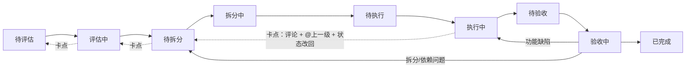

# Codex 集成需求文档

> 版本：v1.0（方向重写：回归原生）
> 日期：2026-08-03
> 关联：Plane CE 1.4.0（`preview` 分支 fork），部署与交接见 [部署说明.md](./部署说明.md)、[交接文档.md](./交接文档.md)

---

## 1. 目标

把 Plane 当作**任务流程工具本身**来使用；流程中的"执行者"角色由 **Codex**（机器人成员）承担，其余角色与交互保持原生。

一句话：**不是给 Plane 加流程，而是把流程里的人换成 Codex。**

---

## 2. 核心决策（已确认）

1. **不做自定义工作流覆盖层**：不新增流程字段、API、前端面板。此前实现已全部移除（提交 `fd35372`，迁移 `0124` 删除字段）。
2. **Codex = 普通项目成员**：`MEMBER(15)`，非管理员；可被指派为任意环节的负责人（主要是执行者）。
3. **环节 = Plane 自定义状态**；**当前环节负责人 = assignee**；**任务单 = 子任务**（原生父子 issue）。
4. **卡点/退回 = 评论 + @上一级 + 状态改回**；**验收 = 验收人把状态推进到"已完成"**。
5. **Codex 配置不进数据库、不进 git**：API token 与代码路径存于 `apps/api/.env`（gitignored）。

---

## 3. Codex 账号

- 用户名 `codex_bot`，用户 ID `11aa7daa-16b6-4b07-8e60-bf0f13cda9f3`；
- `is_bot=True`、`bot_type=CODEX`（禁止交互式登录，只能走 API token）；
- 工作区 `workingcatpet` 与项目 `4c9803a4-e542-4213-b04b-57628bc5bee9` 角色均为 **MEMBER(15)**；
- `apps/api/.env`（gitignored）：`CODEX_BOT_TOKEN`、`CODEX_BOT_USER_ID`、`CODEX_FRONTEND_PATH`；后端路径暂无。

---

## 4. 原生流程用法

### 4.1 状态（在项目设置中创建自定义状态）

（可另加"退回中/卡点"状态；虚线为逐级上抛路径。）

### 4.2 日常操作

| 动作 | 原生方式 |
|---|---|
| 发起问题 | 创建 issue |
| 拆分任务 | 拆分者创建子任务（父 issue 下） |
| 指派环节负责人 | 设置 assignee（评估者/拆分者/执行者/验收者按阶段换人） |
| 推进环节 | 当前负责人改状态 |
| 卡点/退回 | 评论说明 + `@上一级` + 状态改回"退回中" |
| 验收通过 | 验收人推进到"已完成" |
| 验收返工 | 退回执行者（状态改回"执行中"） |
| 完成问题 | 全部子任务完成后关闭父 issue |

### 4.3 Codex 执行

1. 把 Codex 指派为某任务的执行者（assignee = Codex）；
2. Codex 通过 API/对话读取任务内容（含 `CODEX_FRONTEND_PATH` 定位代码）；
3. Codex 实际改代码并自检；
4. Codex 回写：提交验收（改状态/评论说明改动）。

---

## 5. 权限边界

- Codex 只拥有 **MEMBER(15)** 权限：可创建/编辑 issue、评论、推进状态（项目内）；
- 管理员（ADMIN=20）由人担任；Codex 不授予管理员；
- 成员列表已放行 `bot_type=CODEX`，Codex 可被正常指派。

---

## 6. 自动化（可选，未来）

- **半自动**：脚本把"指派给 Codex 且状态=待执行"的任务拼成 prompt → `codex exec` → 回写；
- **全自动**：runner 轮询 Plane API（`CODEX_BOT_TOKEN`）+ 自动验证（`pnpm check`）+ 失败重试；
- 执行护栏：只操作被指派的代码路径、执行前沙箱/审批、结果经人工验收。

---

## 7. 已保留的工程改动（非工作流）

- 前端翻译中文化（活动记录、状态名、相对时间等）；
- 成员列表放行 CODEX 机器人、序列化器暴露 `bot_type`；
- nginx `/locales/` 与 `index.html` no-cache、API 请求 `Cache-Control: no-cache`；
- `entry.client.tsx` 用 `createRoot`（消除 hydration 报错）；
- 移除付费相关 UI。

---

## 8. 历史说明

- v0.1–v0.3 曾设计一套自定义工作流（流程字段、退回/上抛 API、前端面板），经评估后**方向推翻**：Plane 本身即是流程工具，自定义覆盖层反而割裂使用体验；
- 相关代码已全部移除（`fd35372`），如需追溯见 git 历史与 [交接文档.md](./交接文档.md)。
