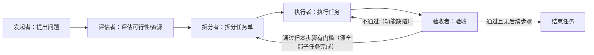
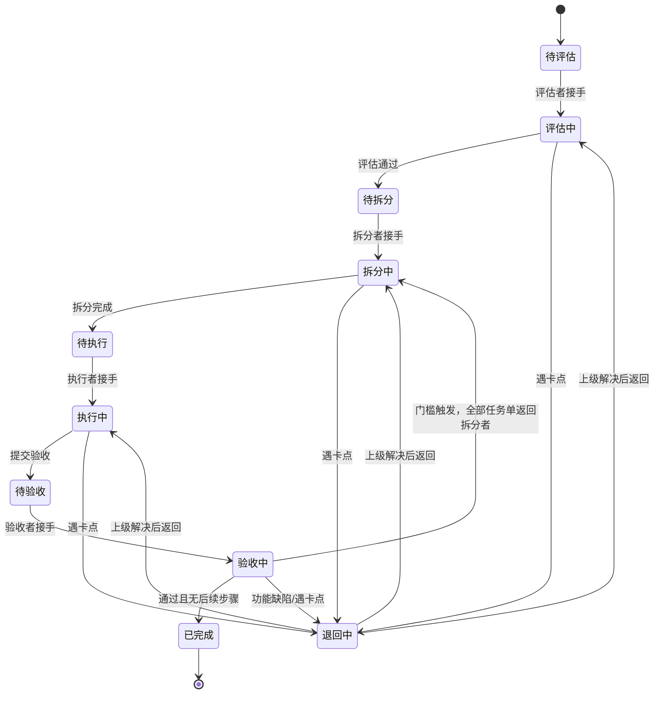
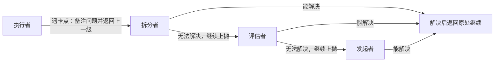
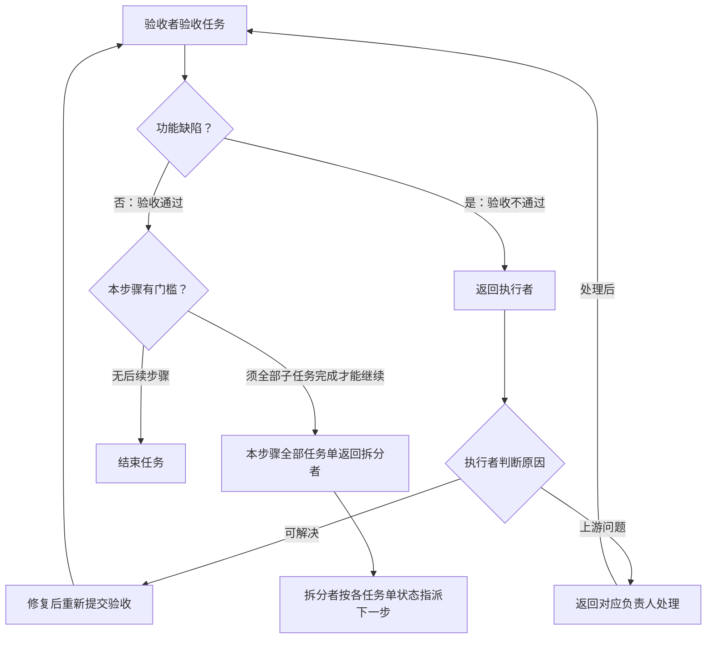

# Codex 角色与项目流程需求文档

> 版本：v0.3（确认流程决策 1-5）
> 日期：2026-08-02
> 关联仓库：`D:\_Code\Server\plane`（Plane CE 1.4.0，preview 分支 fork）
> 部署与接手说明见 [部署说明.md](./部署说明.md) 与 [交接文档.md](./交接文档.md)

---

## 1. 背景与目标

在自托管的 Plane 实例中接入一个名为 **Codex** 的成员（AI 助手），并为其配套一套
**问题 → 评估 → 拆分 → 执行 → 验收** 的结构化项目流程。目标是：

1. Codex 作为普通项目成员参与流程，拥有成员级（非管理员）的全部权限；
2. 每个项目、每个成员拥有各自的前后端代码路径，Codex 执行任务时用它自己的路径定位代码；
3. 流程中任一环节遇到卡点，可在任务上备注并逐级向上汇报；
4. 验收环节按规则决定"结束任务"或"返回拆分者进入下一步"。

---

## 2. 总体原则

- **权限边界**：Codex = 项目成员（MEMBER=15），不是管理员（ADMIN=20）。所有操作必须
  复用现有 `ROLE`/`EUserPermissions` 成员级权限校验（`role__in=[ADMIN, MEMBER]`），
  **不新增 ROLE 枚举值**，避免全量审计 `allowed_roles`。
- **实现形态**：Codex 是机器人成员账号（`is_bot=True`，仿照
  `apps/api/plane/bgtasks/workspace_seed_task.py` 的 bot 用户模式），加入工作区与项目，
  角色为 MEMBER。
- **可指派性**：Codex 可以被指派到流程中的任意环节（评估/拆分/执行/验收等）。

---

## 3. 成员与代码路径

### 3.1 需求

- 对于一个项目，需要记录**前端项目路径**和**后端项目路径**；
- 路径是**按成员配置**的：同一项目下，每个成员各自拥有自己的前后端路径，成员之间可以不同；
- 用途：Codex 被指派为执行者时，用**它自己**配置的路径定位并操作代码；
  人工成员配置的路径供个人使用（如手动任务记录/路由参考）。

### 3.2 数据模型建议

在项目成员关系上扩展两个字段（或独立配置表，键为 `project + member`）：

| 字段 | 类型 | 说明 |
|---|---|---|
| `frontend_path` | string | 该成员在本项目的前端代码路径 |
| `backend_path` | string | 该成员在本项目的后端代码路径 |

### 3.3 界面

- 成员资料/项目成员设置页可查看、编辑各自的前后端路径；
- 路径在任务详情中可见（执行者是谁，路径是什么），方便核对。

---

## 4. 流程角色与分配模型

### 4.1 角色定义

每个问题/任务单的流转涉及以下环节角色：

| 角色 | 职责 |
|---|---|
| 发起者 | 提出问题（创建父 issue），是汇报链的顶端 |
| 评估者 | 评估可行性及所需资源；遇卡点向上汇报 |
| 拆分者 | 将问题拆分为任务单（子 issue）；遇卡点向上汇报 |
| 执行者 | 执行任务；遇卡点向上汇报 |
| 验收者 | 验收任务，决定结束或返回拆分者；遇卡点向上汇报 |

### 4.2 分配模型（结论：任务级动态指派 + 项目级默认名单）

**任务级动态指派（主机制）**

- 每个任务单独立记录**当前环节负责人**，并保留**各环节处理人历史**；
- 卡点"返回上一级"时，退回目标由该任务的历史推导，而不是全局角色；
- Codex 可被指派到任意环节，按任务单粒度和需求变化。

**项目级默认名单（辅助机制）**

- 项目成员表记录本项目各环节的默认负责人（评估者、拆分者、执行者、验收者）；
- 仅用于创建任务单时的**自动建议**，实际处理人按任务单指派，可随时覆盖。

---

## 5. 任务单状态机

### 5.1 流转图

### 5.2 状态说明（建议，具体命名可调）

| 状态 | 含义 | 负责人 |
|---|---|---|
| 待评估 / 评估中 | 评估可行性及资源 | 评估者 |
| 待拆分 / 拆分中 | 拆分为任务单 | 拆分者 |
| 待执行 / 执行中 | 执行任务 | 执行者 |
| 待验收 / 验收中 | 验收任务 | 验收者 |
| 已完成 | 任务结束 | — |
| 退回中 | 被上一级/验收退回处理 | 当前处理人 |
| 卡点 | 卡点备注中，等待上级处理 | 上级处理人 |

### 5.3 问题与任务单的关系

- "问题" = 父 issue；拆分者拆出的"任务单" = 子 issue（复用 Plane 原生父子 issue）；
- 父问题按子任务单的完成情况聚合推进；
- "必须完成所有子任务才能继续"的步骤 = 门槛（gate），由验收环节触发批量返回。

---

## 6. 卡点与反馈机制

### 6.1 通用规则

1. 任一环节遇到卡点：处理人在任务上**备注**实际遇到的问题；
2. 任务**返回上一环节**负责人（该任务单历史中的上一环节处理人）；
3. 上一环节**解决后**，任务返回原处（原环节、原处理人）继续；
4. 上一环节**无法解决**，则继续向上汇报（逐级上抛）。

### 6.2 上抛链

（验收环节的卡点路由见第 7 节。）

### 6.3 备注要求

- 备注需包含：卡点描述、期望的处理方式、影响范围（可选）；
- 备注进入任务活动记录，作为流程审计的一部分。

---

## 7. 验收规则

### 7.1 验收不通过（功能性缺陷）

1. 验收者将任务**返回执行者**；
2. 执行者查看问题原因：
   - **可以解决** → 修复后重新提交验收；
   - **是上游问题** → 返回给**对应负责人**（拆分者/评估者/其他相关成员），由对应负责人处理或继续上抛。

### 7.2 验收通过

按情况二选一：

1. **无后续步骤** → 任务结束（已完成/关闭）；
2. **本步骤存在门槛**（必须完成所有子任务才能继续下一步）：
   - 验收者将**本步骤的全部任务单**返回拆分者；
   - 拆分者根据各任务单状态，指派下一步任务。

### 7.3 验收遇卡点

- **质量问题** → 退回执行者（同 7.1）；
- **拆分/依赖问题** → 继续上抛拆分者（同第 6 节规则）。

---

## 8. Codex 执行机制与自动化

### 8.1 执行方式（按自动化程度分三级）

| 级别 | 方式 | 说明 | 状态 |
|---|---|---|---|
| 0 | 人工会话执行 | 在 Codex 桌面/CLI 会话中领取任务、执行，人工同步任务状态 | 已实测验证（docs 中文改名任务闭环） |
| 1 | 脚本触发 | 脚本/计划任务把任务拼成 prompt，调用 `codex exec` 非交互执行，人工确认后运行 | 待开发 |
| 2 | 完整闭环 runner | 常驻服务轮询 Plane API → 拼 prompt → `codex exec` → 自动验证 → 回写 issue 状态/备注 | 待开发 |

### 8.2 机器人鉴权

- 机器人账号（`is_bot=True`）**禁止交互式登录**（后端代码已明确），统一通过 **API token** 鉴权；
- token 由 runner 持有，存入环境变量/密钥存储，**不得入库**；
- 任务状态回写（完成/备注/推进）全部走 Plane 标准 REST API。

### 8.3 护栏（自动化 ≠ 无脑执行）

1. **沙箱与审批**：`codex exec` 配置沙箱与审批策略，限制危险命令（删除、全局配置修改等）；
2. **自动验证门槛**：执行完成后必须跑测试/类型检查（本项目 `pnpm check`），不过则自动修复或标记失败；
3. **人工验收兜底**：自动化执行 + 验收者（人）把关，验收不通过退回执行者（复用第 7 节规则）；
4. **失败重试**：执行失败/验收不通过 → 退回执行者重试或上抛，避免无限循环。

---

## 9. 与 Plane 现有能力的映射

| 需求 | Plane 现有能力 | 需新增 |
|---|---|---|
| 问题/任务单层级 | 父子 issue（`parent_id`/子 issue） | 流程字段与校验 |
| 环节状态 | 自定义状态（state + state group） | 按流程配置状态组/路由规则 |
| 环节负责人 | issue assignee | 按环节记录处理人历史 |
| 卡点备注 | issue 评论/活动记录 | 退回动作与状态联动 |
| 成员路径 | — | `ProjectMember` 扩展字段 + API/UI |
| 项目级默认名单 | 成员表 role | 默认环节负责人字段 |
| Codex 成员 | bot 用户先例（`workspace_seed_task.py`） | Codex bot 账号创建/加入流程 |

### 后端落点（参考）

- 权限：`apps/api/plane/app/permissions/base.py`（ROLE）、各 `permissions/*.py`
- 成员模型：`apps/api/plane/db/models/workspace.py`（WorkspaceMember/ProjectMember）
- 实例配置：`apps/api/plane/license/api/views/instance.py`
- 路由：`apps/api/plane/urls.py` 及各 app `urls.py`

---

## 10. 决策记录（已确认）

| # | 事项 | 决策 |
|---|---|---|
| 1 | 状态命名与 Plane 状态组映射 | 待* → unstarted；*中 → started；已完成 → completed；退回中/卡点 → started |
| 2 | 流程看板视图 | 阶段 1/2 先用 Plane 现有视图（按状态分组），流程跑通后再决定是否定制看板 |
| 3 | 卡点/退回通知 | 站内通知（复用现有 Notification 模型与铃铛 UI，邮件不可用）；只通知退回的直接接收人（含"解决后返回原处理人"、"验收退回执行者"）；内容 = 标题 + 备注摘要 + 任务链接；阶段 1 纯通知、无动作按钮 |
| 4 | 父问题结束条件 | 无门槛：全部子任务单验收通过后自动关闭；有门槛：拆分者确认后自动关闭；取消的子任务单算闭环、不阻塞关闭；关闭时自动写汇总备注；发起者可重开（重开后重新走评估） |
| 5 | runner 部署形态与 token 管理 | 轮询触发（不用 Webhook：localhost 回调被 SSRF 防护拦截，且轮询无需开端口）；Windows 计划任务；token 存 `.env`（已 gitignore，不入库）；执行方式 `codex exec`；执行后跑 `pnpm check` 作为验证门槛；失败重试 3 次后退回拆分者并写备注 |

---

## 11. 建议实现阶段

0. **零代码验证（已完成）**：真实任务闭环——Codex 会话执行 + 人工验收（docs 中文改名任务）；
1. **数据模型与 API**：成员路径字段、任务单流程字段、退回/上抛端点；
2. **流程与前端**：状态路由、负责人指派、卡点备注/退回 UI、验收批量返回；
3. **脚本触发（级别 1）**：任务 → `codex exec` → 回写的半自动脚本；
4. **完整闭环（级别 2）**：runner 服务 + API token 鉴权 + 自动验证 + 失败重试。
